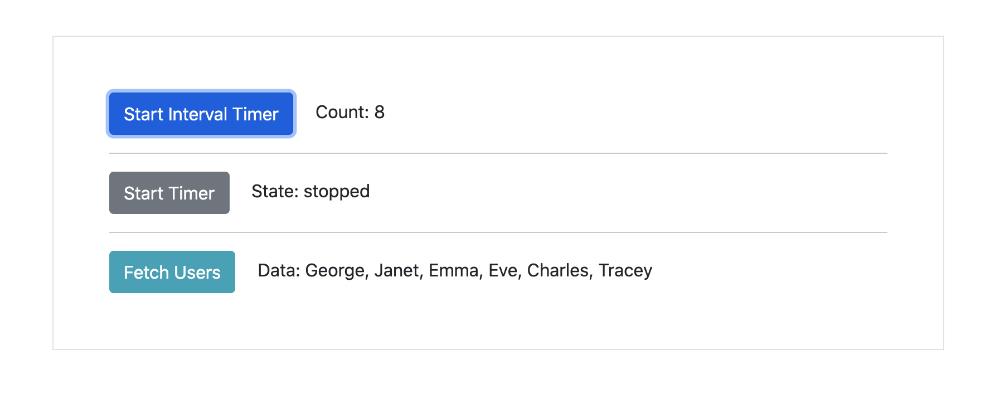
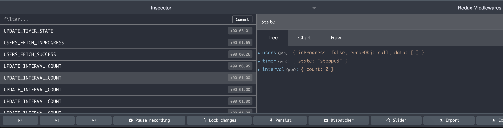

# Redux middlewares
Custom redux middlewares to handle timeout, interval and http request.

# To debug
Install [browser extension](https://chrome.google.com/webstore/detail/redux-devtools/lmhkpmbekcpmknklioeibfkpmmfibljd) to debug redux store.

# How to run?
* Install dependencies using `npm install`
* Run webserver using `npm run start`

# Output

